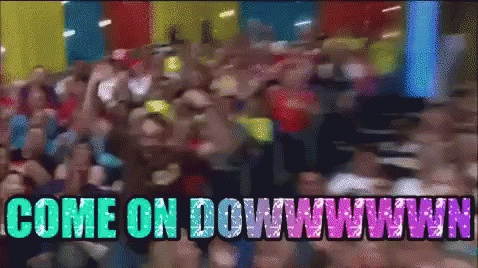
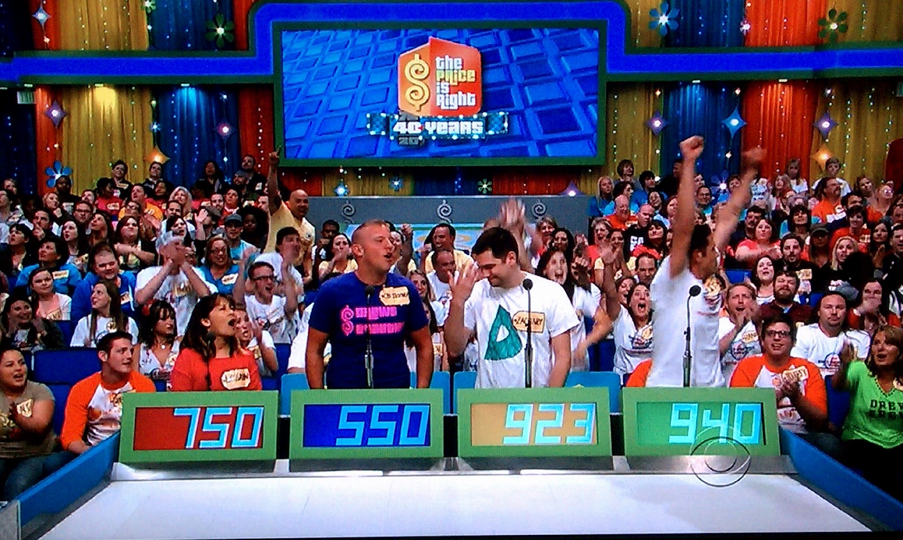
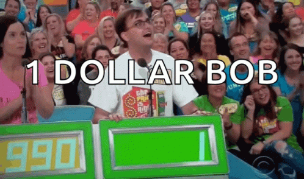

# The Price I$ Right: Binary Search in Javascript
Imagine you are in a technical interview, either as the interviewer or the applicant, and you are about to tackle the live-coding portion of the interview. 

This can be an awkward situation for both parties. Anything you can do to help communicate your goals & priorities during this process is greatly appreciated by your coding partner.
## Contestants Row



For our technical challenge today, we are going to pretend that we are in Contestants Row on The Price I$ Right, and we are bidding on a fabulous prize.

### Goals


You must find the **number** in the array of numbers that is *closest to the prize value*, without going over.

If all of the bids are *over the prize value*, return -1.

### Inputs:
- number - *prize value*
- array of numbers - *bids on the prize*

### Output:
- number - *closest number to the prize value*

## Arrays of Numbers in Interviews
**Binary searches** can be helpful when approaching a *sortable array of numbers*. They can *improve runtime* over a linear approach, since there should be fewer iterations before returning the result.

You may encounter an array of numbers during a techincal interview. This is a good time to *ask if you can sort the array of numbers*, since your approach will depend on if the array is sorted or not. 

- If you **can't sort the array**, then you can't perform a binary search. 
- If the array **can be sorted**, then you can jump right into the binary search approach, leaving more time to complete it. A brute-force linear approach may be more simple to complete, but chances are, you will be asked to improve the runtime of your function. So dive into the binary search.



> Go for the power move, tackle the Binary Search

Here is the [Codepen for Binary Search: The Price I$ Right](https://codepen.io/JasonToups/pen/YzepqGQ) to follow along in code.


## Writing a Binary Search - 1 Step at a Time

Here's the initial scaffold of the function:

```javascript
function closestNumber (num, array) {
  let winningIndex = -1;
  let difference = num;

  // Binary Search goes here
  
  if (winningIndex === -1) {
    return -1
  } else {
    return (`The winning bid is ${array[winningIndex]}`);
  }
};

var prize = 16;
var bidsArray = [32, 22, 17, 1, 5, 71, 65, 59, 89];
console.log(closestNumber(prize, bidsArray));
```

### Sorting Your Array of Numbers
To implement a binary search here, you need to have a sorted array of numbers.

You can do this 1 of 2 ways.

You can create an in-line sort function using the sort method like this:

`array = array.sort((a, b) => a - b);`

Or you can create a `new Float64Array` from the array passed in as an argument to the function, and then sort the new array.

```javascript
var sortedArray = new Float64Array(array);
sortedArray = sortedArray.sort();
```

Creating a new array will use more memory, but it's easier to remember this procedure than it is to remember the in-line sort function.

Since we are concerned about memory usage here, we are going to use the sort array function.

### Three Pointer Approach

Now to write the Binary Search, we need 3 pointers to accomplish this:
1. **start** - `0` // beginning of the arry
2. **end** - `array.length - 1` // end of the array
3. **mid** - `Math.floor((start + end) / 2);` // mid point between start & end

In the array, we need to establish a `start` *point* as a set of numbers, and an `end` *point* of that set. 

`mid` is going to be the *mid point* between the `start` & `end`, which will be the array index that will be *evaluated for every cycle of our loop*.

For the **mid calculation**, we are using `Math.floor()` to *round down to a whole integer*. 

Otherwise, without this Math operation, we would be evaluating numbers with decimal points for the mid index in the array, after start & end are added together and divided in half.

### Controlling the 3 Pointers

  Three things need to happen here to handle the `start`, `mid` & `end` pointers:
  1. We need to check if the `mid` index value is equal to the price of the prize.
     1. If this is **true**, then **return** the `mid` index value in the array.
  2. If the `mid` index value is **less than** the price, then we need to set `start` to the `mid + 1`. --> **Reducing** the set of numbers *from the middle to the end value*.
     1. If this is **true**, then we need to check if the **difference** between the `price` and the `mid` value is less than the `difference` variable, but *also larger than or equal to 0*.
        1. If this is **true**, set the new `difference` value.
        2. And set the `winningIndex` to `mid`.
  3. If the `mid` index value is **more than** the price, then we need to set `end` to `mid - 1`. --> **Reducing** the set of numbers *from the start value to the mid value*.
  
```javascript
if (array[mid] === num) {
  return `The winning bid is ${array[mid]}`;
} else if (array[mid] < num) {
  if ((num - array[mid]) <= difference && (num - array[mid]) >= 0) {
    difference = (num - array[mid]);
    winningIndex = mid;
  } 
  start = mid + 1;
} else {
  end = mid - 1;
}
```


TODO - pickup editing the article from here to the end
```javascript
function closestNumber (num, array) {
  let winningIndex = -1;
  let difference = num;

  // we need to sort the array to use binary search
  array = array.sort((a, b) => a - b);
  
  // we need a 3 pointer approach to track the start & end indexes, along with the middle of them, which will be set during each while loop.
  let start = 0;
  let end = array.length - 1;
  // Use Math.floor() to round down to the nearest whole number.
  let mid = Math.floor((start + end) / 2);

  // Three things need to happen here to handle the start & end pointers:
  // 1. We need to check if the mid index is the price of the prize.
  // If this is tru, then return the mid index.
  // 2. If the mid value is less than the price, then we need to set the start to the mid + 1.
  // If this is true, then we need to check if the difference between the price and the mid value is less than the difference variable, but also larger than or equal to 0.
  // Set the new difference value.
  // Set the winningIndex to mid.
  // 3. If it is more than the winning index, then we need to set the end to the mid - 1.
  while (start<=end) {
    // To perform the binary search, we need to find the middle index of the array, for every cycle of the loop.
    mid = Math.floor((start + end) / 2);

    if (array[mid] === num) {
      return `The winning bid is ${array[mid]}`;
    } else if (array[mid] < num) {
      if ((num - array[mid]) <= difference && (num - array[mid]) >= 0) {
        difference = (num - array[mid]);
        winningIndex = mid;
      } 
      start = mid + 1;
    } else {
      end = mid - 1;
    }
  }

  if (winningIndex === -1) {
    return -1
  } else {
    return (`The winning bid is ${array[winningIndex]}`);
  }
};
```